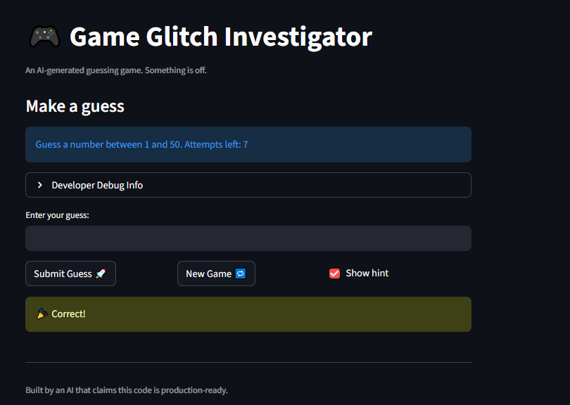

# 🎮 Game Glitch Investigator: The Impossible Guesser

## 🚨 The Situation

You asked an AI to build a simple "Number Guessing Game" using Streamlit.
It wrote the code, ran away, and now the game is unplayable. 

- You can't win.
- The hints lie to you.
- The secret number seems to have commitment issues.

## 🛠️ Setup

1. Install dependencies: `pip install -r requirements.txt`
2. Run the broken app: `python -m streamlit run app.py`

## 🕵️‍♂️ Your Mission

1. **Play the game.** Open the "Developer Debug Info" tab in the app to see the secret number. Try to win.
2. **Find the State Bug.** Why does the secret number change every time you click "Submit"? Ask ChatGPT: *"How do I keep a variable from resetting in Streamlit when I click a button?"*
3. **Fix the Logic.** The hints ("Higher/Lower") are wrong. Fix them.
4. **Refactor & Test.** - Move the logic into `logic_utils.py`.
   - Run `pytest` in your terminal.
   - Keep fixing until all tests pass!

## 📝 Document Your Experience

- [X] Describe the game's purpose.

   The Game Glitch Investigator is a number guessing game built with Streamlit where players try to guess a randomly generated secret number. Players select a difficulty level (Easy, Normal, or Hard) which sets the range of numbers and the number of attempts allowed. After each guess, the game provides hints telling the player whether to guess higher or lower. Players earn a score based on how many wrong guesses they made before winning, with a maximum of 100 points for a perfect game.

- [X] Detail which bugs you found.
1. Incorrect Attempt Limits: The Easy mode had fewer attempts allowed than Normal mode, which didn't make sense for difficulty levels.
2. Backwards Hints: The hint messages were reversed when your guess was too high, it said to go higher, and when it was too low, it said to go lower.
3. Show Hint Toggle Bug: Once you toggled the 'Show hint' checkbox on and off, the hints would stop displaying until you restarted the entire game.
4. New Game Button Broken: Clicking the 'New Game' button didn't properly reset the game state, so you couldn't start a fresh game without restarting the app.
- [X] Explain what fixes you applied.
1. Fixed Attempt Limits: I corrected the attempt_limit_map so that Easy mode now allows 10 attempts, Normal allows 7, and Hard allows 5 making the difficulty levels make sense.
2. Fixed Backwards Hints: I corrected the check_guess() function to return the proper hint messages so that when your guess is too high it says 'Go LOWER!' and when it's too low it says 'Go HIGHER!'.
3. Fixed New Game Button: I updated the 'New Game' button to properly reset the session state by resetting attempts to 1, status to 'playing', score to 0, history to an empty list, and generating a new secret number with st.rerun().
4. Fixed Show Hint Toggle: I fixed the checkbox behavior by ensuring the show_hint checkbox had proper state handling so hints would display consistently when toggled.
5. All logic functions were already organized in logic_utils.py and I verified all 40 tests pass with pytest.
## 📸 Demo

## 🚀 Stretch Features

- [ ] [If you choose to complete Challenge 4, insert a screenshot of your Enhanced Game UI here]
